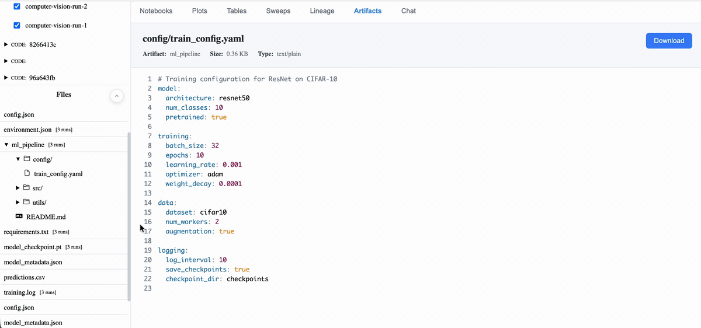

<div align="center">

# Artifacta

**Universal experiment and artifact tracking — gain insights and optimize models with confidence.**

[](https://www.python.org/downloads/)
[](LICENSE)
[](https://github.com/psf/black)

</div>

---

## ✨ Key Features

- 🌐 **Domain-agnostic** - Track any experiment comparing parameters, data, and outcomes
- 📊 **Automatic visualization** - Plots discovered from logged data structure
- 🔗 **Artifact tracking** - Track datasets, models, code, and results with full provenance
- 🔄 **Multi-run comparison** - Overlay time series and curves for easy comparison
- 🎯 **Hyperparameter analysis** - Automatically detect and analyze parameter impact on outcomes
- 💬 **AI assistant** - Chat interface for experiment insights (OpenAI, Anthropic, local LLMs)

---

## 🎨 Visual Overview

**Automatic Plot Discovery**


Artifacta automatically generates visualizations based on your data shape and metadata. No manual plot configuration needed.

**Artifact Management**



Browse and preview datasets, models, code, images, videos, and documents with built-in file viewers.

---

## 🚀 Quick Start

### Installation

**Prerequisites:** Python 3.9+

```bash
pip install artifacta
```

That's it! The UI is pre-built and bundled. No Node.js required.

#### Development Installation

If you want to contribute or modify the source:

**Prerequisites:** Python 3.9+, Node.js 16+

```bash
# Clone the repository
git clone https://github.com/walkerbdev/artifacta.git
cd artifacta

# Build UI from source
npm install && npm run build

# Install Python package in editable mode
pip install -e .
```

### Start Tracking Server

```bash
artifacta ui
```

The web UI will be available at http://localhost:8000 (default).

You can customize host and port:

```bash
artifacta ui --host 0.0.0.0 --port 8000
```

**Development Mode:** Run with hot-reload for UI development:

```bash
artifacta ui --dev
```

### Log Your First Experiment

```python
import artifacta as ds

# Initialize a run
run = ds.init(
    project="my-project",
    name="experiment-1",
    config={"learning_rate": 0.001, "batch_size": 32}
)

# Log metrics during training
for epoch in range(10):
    train_loss = train_model()  # Your training code

    ds.log("metrics", ds.Series(
        index="epoch",
        fields={
            "train_loss": [train_loss],
            "epoch": [epoch]
        }
    ))

# Log artifacts (models, plots, etc.)
run.log_artifact("model.pt", "path/to/model.pt")
```

---

## 📚 Documentation

Full documentation available at: [User Guide](docs/user-guide.rst)

Build and serve docs locally:

```bash
pip install artifacta[dev]
cd docs && make html
python -m http.server 8001 --directory _build/html
```

Then navigate to http://localhost:8001

---

## 📊 Core Primitives

Artifacta provides rich primitives for structured logging:

- **Series** - Time series data (loss curves, accuracy over time)
- **Curve** - ROC curves, PR curves with AUC metrics
- **Distribution** - Histograms and distributions
- **Matrix** - Confusion matrices and heatmaps
- **Scatter** - 2D scatter plots (embeddings, parameter spaces)
- **BarChart** - Categorical comparisons
- **Table** - Structured tabular data

All primitives are automatically visualized in the Plots tab.

---

## 💻 Web UI Features

- **Plots** - Auto-generated visualizations with multi-run overlay
- **Sweeps** - Hyperparameter analysis with parallel coordinates
- **Artifacts** - File browser with preview for code, images, video, audio
- **Tables** - Metric aggregation and comparison tables
- **Lineage** - Visual artifact provenance graphs
- **Notebooks** - Rich text lab notebook with LaTeX support
- **Chat** - AI assistant for experiment analysis

---

## 💡 Examples

See [examples/](examples/) for runnable examples:

- **PyTorch MNIST** - Image classification with autolog
- **TensorFlow Regression** - Time series forecasting
- **A/B Testing** - Conversion rate analysis with statistical tests

Additional domain examples available in [tests/domains/](tests/domains/):

- Climate modeling, Computer vision, Finance, Genomics, Physics, Robotics, and more

**Run examples:**

```bash
source venv/bin/activate
python examples/ab_testing.py
```

---

## 🧪 Running Tests

Start the tracking server in one terminal:

```bash
source venv/bin/activate
artifacta ui
```

Run tests in another terminal:

```bash
source venv/bin/activate
pytest tests/
```
