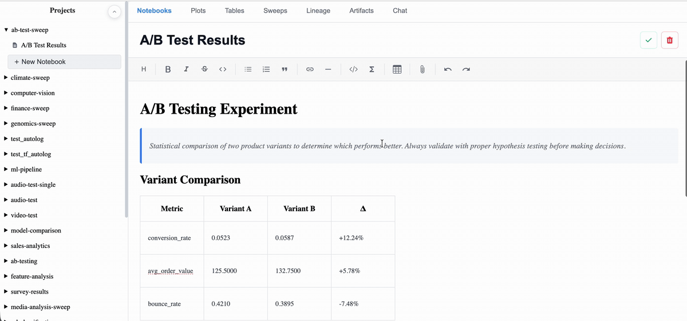
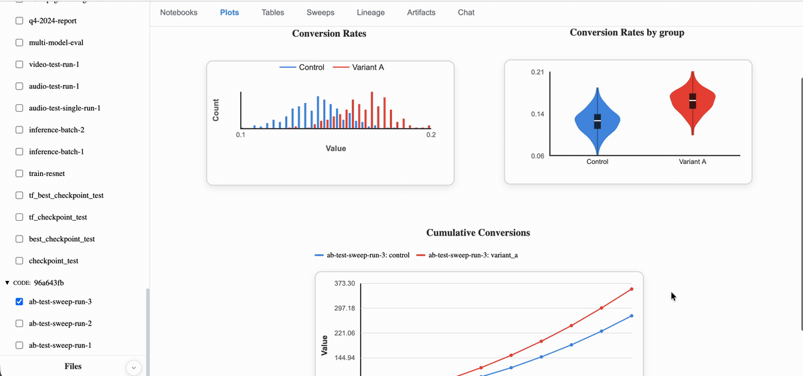
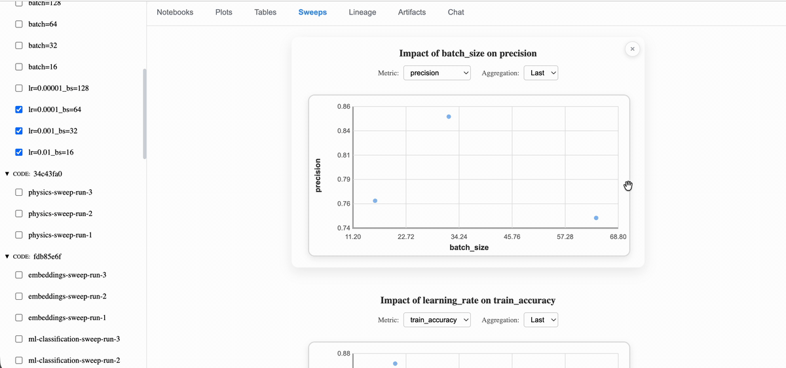
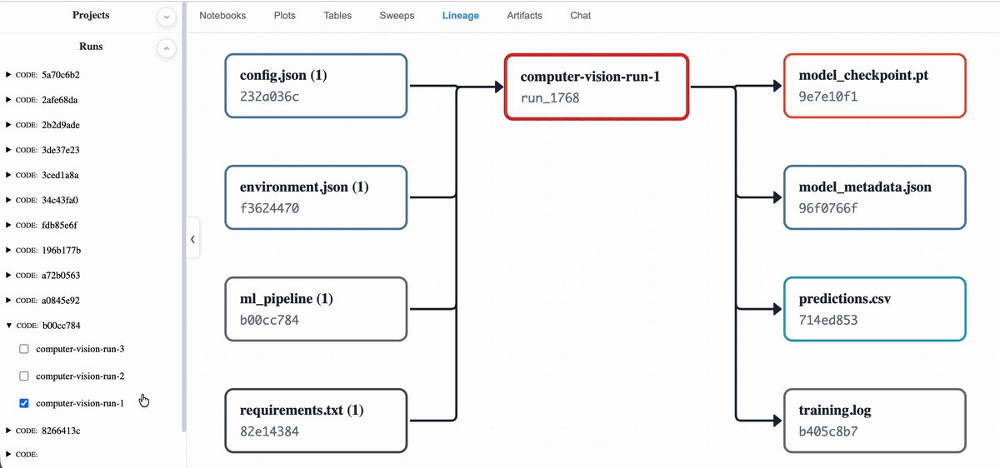
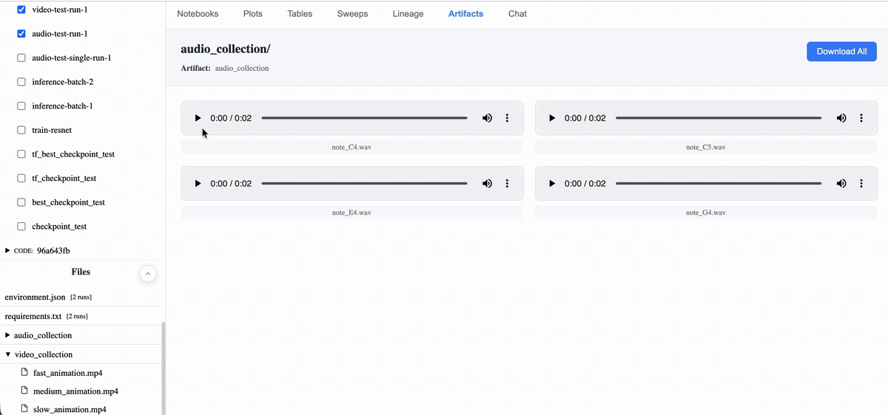

Quick Start Guide
=================

The Problem
-----------

Modern data science and machine learning workflows involve countless experiments—tweaking hyperparameters, adjusting data preprocessing, testing different architectures, updating dependencies, modifying code. **Every change produces different results**, but tracking and comparing these variations manually becomes overwhelming:

- 📋 Which parameters, environment, or code version led to that breakthrough result last week?
- 🔍 How does changing the learning rate affect convergence across multiple runs?
- 📊 What's the actual performance difference between model architectures?
- 🤔 Which preprocessing steps improved accuracy by 2%?
- 🔧 Did upgrading that dependency break model performance?
- 💻 What code changes caused the regression?

Without systematic tracking of **parameters, metrics, code changes, dependencies, and environment**, you're flying blind—relying on scattered notes, terminal output, and memory. **Artifacta solves this** by automatically capturing experiments, configurations, code versions, and artifacts in one place with intelligent visualization.

Ecosystem & Alternatives
------------------------

Artifacta is part of a growing ecosystem of experiment tracking tools. Here's how we compare to popular alternatives:

.. list-table:: Feature Comparison
   :header-rows: 1
   :widths: 30 14 14 14 14 14

   * - Feature
     - Artifacta
     - MLflow
     - W&B
     - Neptune.ai
     - Comet ML
   * - **Deployment**
     -
     -
     -
     -
     -
   * - Fully offline/local
     - ✅
     - ✅
     - ⚠️
     - ❌
     - ⚠️
   * - Pre-built UI (no Node.js)
     - ✅
     - ❌
     - ❌
     - ❌
     - ❌
   * - Self-hosted (free)
     - ✅
     - ✅
     - ⚠️
     - ⚠️
     - ⚠️
   * - **Visualization**
     -
     -
     -
     -
     -
   * - Line/series charts
     - ✅
     - ✅
     - ✅
     - ✅
     - ✅
   * - Bar charts
     - ✅
     - ⚠️
     - ✅
     - ⚠️
     - ⚠️
   * - Histograms
     - ✅
     - ⚠️
     - ✅
     - ✅
     - ⚠️
   * - Scatter plots
     - ✅
     - ⚠️
     - ✅
     - ⚠️
     - ⚠️
   * - Heatmaps
     - ✅
     - ⚠️
     - ❌
     - ⚠️
     - ⚠️
   * - ROC/PR curves
     - ✅
     - ✅
     - ✅
     - ⚠️
     - ⚠️
   * - Confusion matrix
     - ✅
     - ✅
     - ✅
     - ⚠️
     - ⚠️
   * - Parallel coordinates
     - ✅
     - ✅
     - ✅
     - ✅
     - ✅
   * - Multi-run overlay
     - ✅
     - ✅
     - ✅
     - ✅
     - ✅
   * - **Artifact Management**
     -
     -
     -
     -
     -
   * - Built-in file browser
     - ✅
     - ✅
     - ✅
     - ✅
     - ✅
   * - Rich media preview
     - ✅
     - ⚠️
     - ✅
     - ✅
     - ✅
   * - Artifact lineage
     - ✅
     - ❌
     - ✅
     - ✅
     - ✅
   * - **Analysis**
     -
     -
     -
     -
     -
   * - Auto-logging environment/system info
     - ✅
     - ✅
     - ✅
     - ✅
     - ✅
   * - Hyperparameter correlation
     - ✅
     - ✅
     - ✅
     - ✅
     - ✅
   * - Parameter importance
     - ❌
     - ❌
     - ✅
     - ❌
     - ✅
   * - Built-in ELN (lab notebook)
     - ✅
     - ❌
     - ❌
     - ❌
     - ❌
   * - AI assistant
     - ✅
     - ❌
     - ⚠️
     - ❌
     - ⚠️
   * - **Domain Support**
     -
     -
     -
     -
     -
   * - Domain-agnostic
     - ✅
     - ✅
     - ❌
     - ⚠️
     - ❌
   * - **Production & Deployment**
     -
     -
     -
     -
     -
   * - Model registry
     - ❌
     - ✅
     - ✅
     - ✅
     - ✅
   * - Model deployment/serving
     - ❌
     - ✅
     - ✅
     - ✅
     - ✅
   * - Production monitoring
     - ❌
     - ❌
     - ⚠️
     - ✅
     - ✅
   * - Alerts/notifications
     - ❌
     - ❌
     - ✅
     - ✅
     - ✅
   * - **Ecosystem**
     -
     -
     -
     -
     -
   * - Framework autologging
     - ✅
     - ✅
     - ✅
     - ✅
     - ✅
   * - Hyperparameter sweeps
     - ❌
     - ⚠️
     - ✅
     - ⚠️
     - ✅
   * - Team collaboration
     - ❌
     - ⚠️
     - ✅
     - ✅
     - ✅
   * - Managed cloud
     - ❌
     - ✅
     - ✅
     - ✅
     - ✅

**Legend:** ✅ Full support | ⚠️ Partial/Limited | ❌ Not available

**⚠️ Notes:**

- **MLflow**: Can be used for non-ML experiments; has documented A/B testing and analytics use cases
- **Neptune**: No documented non-ML examples
- **W&B, Comet**: ML-focused with no documented non-ML use cases
- **W&B**: Production monitoring available but less comprehensive than Neptune/Comet
- **MLflow**: No built-in production monitoring; requires external tools
- **Artifacta**: Full autologging for scikit-learn, XGBoost, PyTorch Lightning, and TensorFlow/Keras (automatically captures parameters, metrics, models, and datasets)
- **MLflow**: Open-source version lacks permissions; full collaboration requires Databricks Managed MLflow
- **MLflow**: Basic hyperparameter tracking but no automated sweep optimization like W&B/Comet
- **Neptune**: No built-in sweep optimization; integrates with external tools like Optuna

Why Choose Artifacta?
~~~~~~~~~~~~~~~~~~~~~~

**What makes Artifacta different:**

- **Zero configuration** - Pre-built UI bundled with Python package—``pip install`` and you're done. No Node.js, Docker, or build tools required
- **Truly offline-first** - Works 100% locally without any cloud dependencies, license servers, or internet connection
- **Server-side plot generation** - Log data primitives (Series, Scatter, Matrix), not matplotlib figures—Artifacta renders plots for you. No need to create and upload images (though you can if you want)
- **Built-in electronic lab notebook** - Rich text editor with LaTeX support, file attachments, and per-project organization—not available in any competitor
- **AI chat interface** - Built-in LLM chat (OpenAI, Anthropic, local models) to analyze experiments, results, and code. W&B and Comet have AI features in premium tiers only
- **Domain-agnostic design** - Primitives work for any field—ML, A/B tests, physics, finance, genomics, climate science. Not ML-only like most alternatives
- **Rich artifact previews** - Built-in viewers for video, audio, PDFs, code, images. MLflow only previews images; others require external viewers
- **Interactive artifact lineage** - Visual flow graph showing how artifacts relate. MLflow has no lineage visualization

When to Choose Alternatives
~~~~~~~~~~~~~~~~~~~~~~~~~~~~

- **MLflow** - If you need autologging beyond scikit-learn/XGBoost (e.g., PyTorch, TensorFlow, LightGBM) or already use Databricks
- **Weights & Biases** - If team collaboration is essential, or you want powerful hyperparameter sweeps with optimization
- **Neptune.ai** - If you need comprehensive system monitoring (ongoing CPU/GPU/memory tracking) or work with very large-scale experiments
- **Comet ML** - If you need advanced custom dashboards or detailed experiment comparison tools

Installation
------------

**Prerequisites:** Python 3.9+

.. code-block:: bash

   pip install artifacta

.. note::
   The UI is pre-built and bundled with the package. No Node.js required.

Development Installation
~~~~~~~~~~~~~~~~~~~~~~~~

**Prerequisites:** Python 3.9+, Node.js 16+

For contributors who want to modify the source code or UI:

.. code-block:: bash

   # Clone the repository
   git clone https://github.com/walkerbdev/artifacta.git
   cd artifacta

   # Build UI from source
   npm install && npm run build

   # Install Python package in editable mode
   pip install -e .

To run examples or tests, install with optional dependencies:

.. code-block:: bash

   pip install -e .[dev]

For generating real test videos (optional, requires FFmpeg):

.. code-block:: bash

   pip install -e .[dev,video]

Note: Video artifact logging works without this - test helpers will use placeholder MP4 files instead of generating real videos.

Starting the Tracking Server
-----------------------------

Production Mode (Default)
~~~~~~~~~~~~~~~~~~~~~~~~~

Start the server with the bundled UI:

.. code-block:: bash

   artifacta ui

The web UI will be available at http://localhost:8000 (default).

You can customize host and port:

.. code-block:: bash

   artifacta ui --host 0.0.0.0 --port 8000

Development Mode
~~~~~~~~~~~~~~~~

For UI development with hot-reload (requires Node.js):

.. code-block:: bash

   artifacta ui --dev

This starts:

- Tracking server on http://localhost:8000 (configurable with ``--port``)
- Vite dev server on http://localhost:5173 (configurable with ``--ui-port``)

The dev server provides hot module replacement for rapid UI development.

Basic Usage
-----------

Here's a simple example to get you started:

.. code-block:: python

   from artifacta import Series, init, log

   # Initialize a run
   run = init(
       project="my-project",
       name="experiment-1",
       config={"learning_rate": 0.001, "batch_size": 32}
   )

   # Log metrics during training
   for epoch in range(10):
       train_loss = train_model()  # Your training code

       # Log metrics as a Series
       log("metrics", Series(
           index="epoch",
           fields={
               "train_loss": [train_loss],
               "epoch": [epoch]
           }
       ))

   # Log artifacts (models, plots, etc.)
   run.log_artifact("model.pt", "path/to/model.pt")

   # Run automatically finishes when script exits!

Automatic Metadata Capture
---------------------------

Artifacta automatically captures environment context when you call ``artifacta.init()``. This happens transparently in the background—no additional code required.

**What Gets Captured:**

**Git Information**
   - Commit hash (SHA)
   - Remote repository URL
   - Dirty status (whether you have uncommitted changes)

**Environment**
   - Hostname and username
   - Python version
   - Operating system and platform
   - Working directory
   - Command-line arguments used to run your script

**System Hardware**
   - CPU count (physical and logical cores)
   - Total RAM
   - GPU information (name, memory) if available via ``pynvml``

**Dependencies**
   - Full ``pip freeze`` output capturing all installed packages and versions

**How It's Stored:**

Metadata is automatically saved as artifacts with SHA256 content hashes:

- **config.json** - Your hyperparameters and config dict (linked to run via ``config_artifact_id``)
- **requirements.txt** - Full ``pip freeze`` output with exact package versions
- **environment.json** - Python version, platform, CUDA version, etc.

Each artifact is content-addressed using SHA256 hashing, enabling:

- **Deduplication** - Identical dependencies/configs across runs share the same artifact
- **Integrity** - Verify artifact contents haven't been tampered with
- **Reproducibility** - Exact environment can be reconstructed from the hash

**Viewing Metadata:**

All captured metadata is stored with each run and visible in the web UI. This allows you to:

- Reproduce experiments by seeing exact commit, dependencies, and environment
- Debug issues by comparing system configurations across runs
- Track when dependency upgrades caused performance changes
- Identify which code version produced specific results

**Privacy Note:**

Metadata capture runs locally and is stored only in your local database. No data is sent externally. If you're working in a sensitive environment, you can inspect what's captured in the metadata before sharing experiment results.

Logging
=======

This section covers what you log from your training scripts using Artifacta.

Logging Metrics
---------------

Artifacta provides rich primitives for logging structured data. These primitives are visualized in the **Plots** tab in the web UI.

**Multi-Run Comparison**: When multiple runs are selected, **Series** and **Curve** primitives are automatically overlaid on the same plot for easy comparison. Other primitives (Matrix, Distribution, Scatter, etc.) are kept separate per run to avoid visual clutter.

**Series** - Time series data (supports multi-run overlay):

.. code-block:: python

   from artifacta import log, Series

   log("training", Series(
       index="step",
       fields={
           "loss": [0.5, 0.3, 0.2],
           "accuracy": [0.6, 0.8, 0.9]
       }
   ))

**Distribution** - Histograms and distributions:

.. code-block:: python

   from artifacta import log, Distribution
   import numpy as np

   log("weights", Distribution(
       values=np.random.randn(1000)
   ))

**Scatter** - 2D scatter plots:

.. code-block:: python

   from artifacta import log, Scatter

   log("embeddings", Scatter(
       x=[1, 2, 3, 4],
       y=[2, 4, 6, 8],
       labels=["A", "B", "C", "D"]
   ))

**Matrix** - Confusion matrices and heatmaps:

.. code-block:: python

   from artifacta import log, Matrix

   log("confusion_matrix", Matrix(
       rows=["True A", "True B"],
       cols=["Class A", "Class B"],
       values=[[10, 2], [3, 15]]
   ))

**Curve** - ROC curves, PR curves, and other X-Y relationships (supports multi-run overlay):

.. code-block:: python

   from artifacta import log, Curve
   from sklearn.metrics import roc_curve, auc

   fpr, tpr, _ = roc_curve(y_true, y_scores)
   roc_auc = auc(fpr, tpr)

   log("roc_curve", Curve(
       x=fpr.tolist(),
       y=tpr.tolist(),
       x_label="False Positive Rate",
       y_label="True Positive Rate",
       baseline="diagonal",
       metric={"name": "AUC", "value": float(roc_auc)}
   ))

**BarChart** - Categorical comparisons and model performance:

.. code-block:: python

   from artifacta import log, BarChart

   log("model_comparison", BarChart(
       categories=["ResNet-50", "EfficientNet-B0", "ViT-Base"],
       groups={
           "accuracy": [0.85, 0.88, 0.90],
           "f1_score": [0.83, 0.86, 0.89]
       },
       x_label="Model Architecture",
       y_label="Score",
       stacked=False
   ))

**Table** - Structured tabular data:

.. code-block:: python

   from artifacta import log, Table

   log("top_variants", Table(
       columns=[
           {"name": "Chromosome", "type": "string"},
           {"name": "Position", "type": "number"},
           {"name": "Type", "type": "string"},
           {"name": "Quality", "type": "number"}
       ],
       data=[
           ["chr1", 12345678, "SNP", 95.2],
           ["chr2", 98765432, "INDEL", 88.7],
           ["chr3", 45678901, "SNP", 92.1]
       ]
   ))

Logging Artifacts
-----------------

Log files like models, datasets, code, and configuration. Artifacts appear in the **Artifacts** tab in the web UI.

.. code-block:: python

   # Log a trained model with artifact metadata
   run.log_artifact("model_checkpoint", "checkpoints/resnet50_best.pt", metadata={
       "framework": "PyTorch",
       "architecture": "ResNet-50",
       "model_size_mb": 45.3,
       "author": "CV Team"
   })

   # Log source code directory (automatically recursive)
   run.log_artifact("training_code", "src/")

Framework Autologging
---------------------

Artifacta provides zero-configuration autologging for popular ML frameworks. Enable once, and all training parameters, metrics, and models are automatically captured.

**What is logged:**

- **Parameters**: Hyperparameters, optimizer config (via ``run.update_config()``)
- **Metrics**: Training/validation metrics per epoch (via ``run.log()``)
- **Models**: Trained models and checkpoints (via ``run.log_artifact()``)
- **Datasets**: Input data metadata - shape, dtype, hash (sklearn/XGBoost only)

scikit-learn
~~~~~~~~~~~~

.. code-block:: python

   import artifacta as ds
   from sklearn.ensemble import RandomForestClassifier

   # Enable autolog
   ds.autolog()  # Auto-detects sklearn

   # Or explicitly
   from artifacta.integrations import sklearn
   sklearn.enable_autolog()

   # Train as usual - everything logged automatically
   clf = RandomForestClassifier(n_estimators=100, max_depth=5)
   clf.fit(X_train, y_train)

   # Logged: n_estimators=100, max_depth=5, training accuracy,
   # confusion matrix, ROC curve, model artifact, dataset metadata

XGBoost
~~~~~~~

.. code-block:: python

   import artifacta as ds
   import xgboost as xgb

   # Enable autolog
   ds.autolog()  # Auto-detects XGBoost

   # Native API
   dtrain = xgb.DMatrix(X_train, y_train)
   dtest = xgb.DMatrix(X_test, y_test)
   params = {"max_depth": 3, "eta": 0.1}

   booster = xgb.train(params, dtrain, num_boost_round=100,
                       evals=[(dtrain, "train"), (dtest, "test")])

   # Logged: max_depth, eta, per-iteration metrics (train/test loss),
   # feature importance, model artifact, dataset metadata

PyTorch Lightning
~~~~~~~~~~~~~~~~~

.. code-block:: python

   import artifacta as ds
   import pytorch_lightning as pl

   # Enable autolog
   ds.autolog()  # Auto-detects PyTorch Lightning

   # Train as usual
   trainer = pl.Trainer(max_epochs=10)
   trainer.fit(model, train_loader)

   # Logged: epochs=10, optimizer_name, learning_rate,
   # per-epoch metrics (loss, accuracy), checkpoints, final model

TensorFlow/Keras
~~~~~~~~~~~~~~~~

.. code-block:: python

   import artifacta as ds
   import tensorflow as tf

   # Enable autolog
   ds.autolog()  # Auto-detects TensorFlow/Keras

   # Train as usual
   model.compile(optimizer='adam', loss='mse', metrics=['mae'])
   model.fit(x_train, y_train, epochs=10, batch_size=32)

   # Logged: epochs=10, batch_size=32, optimizer_name, learning_rate,
   # per-epoch metrics (loss, mae), checkpoints, final model

Configuration Options
~~~~~~~~~~~~~~~~~~~~~

.. code-block:: python

   # Disable specific features
   from artifacta.integrations import sklearn
   sklearn.enable_autolog(
       log_models=False,        # Don't log model artifacts
       log_datasets=False,      # Don't log dataset metadata
       log_training_metrics=False  # Don't compute training metrics
   )

   # PyTorch/TensorFlow options
   from artifacta.integrations import pytorch_lightning
   pytorch_lightning.enable_autolog(
       log_checkpoints=False,   # Don't log per-epoch checkpoints
       log_models=True          # Still log final model
   )

Language-Agnostic Logging
--------------------------

You can interact with the backend directly using HTTP requests. Useful for non-Python environments or custom integrations.

**Health Check:**

.. code-block:: bash

   curl http://127.0.0.1:8000/health

**Create a Run:**

.. code-block:: bash

   curl -X POST http://127.0.0.1:8000/api/runs \
     -H 'Content-Type: application/json' \
     -d '{
       "run_id": "my-run-123",
       "project": "my-project",
       "name": "Experiment 1",
       "config": {"learning_rate": 0.001}
     }'

**Log Metrics (Series):**

.. code-block:: bash

   curl -X POST http://127.0.0.1:8000/api/runs/my-run-123/data \
     -H 'Content-Type: application/json' \
     -d '{
       "name": "training_metrics",
       "primitive_type": "Series",
       "section": "training",
       "data": {
         "index": "step",
         "fields": {
           "loss": [0.5, 0.3, 0.2],
           "step": [1, 2, 3]
         }
       }
     }'

**Register Artifact:**

.. code-block:: bash

   curl -X POST http://127.0.0.1:8000/api/artifacts \
     -H 'Content-Type: application/json' \
     -d '{
       "run_id": "my-run-123",
       "name": "model.pt",
       "hash": "abcd1234",
       "storage_path": "/path/to/model.pt",
       "size_bytes": 1024,
       "metadata": {"framework": "PyTorch"},
       "role": "output"
     }'

**Get Run Details:**

.. code-block:: bash

   curl http://127.0.0.1:8000/api/runs/my-run-123

**List All Runs:**

.. code-block:: bash

   curl 'http://127.0.0.1:8000/api/runs?limit=10'

UI Features
===========

The Artifacta web UI provides several features for visualizing and managing your experiments.

**Important**: To see data in the UI, you must first log it to the database using ``artifacta.init()`` and ``log()`` in your Python scripts. Then select runs from the **Runs** section in the sidebar.

UI Selection Requirements
--------------------------

Different tabs require different selections to display content:

**Plots Tab** - Requires **at least 1 run selected**

**Sweeps Tab** - Requires **at least 2 runs selected** with same config structure and varying parameters

**Artifacts Tab** - Requires **at least 1 run selected** AND **a file selected from the Files panel in sidebar**

**Tables Tab** - Requires **at least 1 run selected**

**Lineage Tab** - Requires **at least 1 run selected**

**Notebooks Tab** - No selection needed (project-level documentation)

Notebooks Tab
-------------

The **Notebooks** tab provides a rich text editor for documenting experiments:

- **Rich text editing** - Format text with headings, bold, italic, lists, code blocks, and more
- **File attachments** - Upload and preview images, PDFs, audio, video, and code files inline
- **Math equations** - Insert LaTeX equations using ``$...$`` syntax
- **Tables** - Create tables directly in the editor
- **Project organization** - Group notes by project to keep experiments organized

Create and edit notes directly in the web UI using the rich text editor.

**Supported Attachment Formats:**

**Code & Text Files** (inline preview with syntax highlighting)
   - Python (.py), JavaScript (.js, .jsx), TypeScript (.ts, .tsx)
   - Java (.java), C/C++ (.c, .cpp), Ruby (.rb), Go (.go), Rust (.rs)
   - PHP (.php), Swift (.swift), Kotlin (.kt)
   - SQL (.sql), Shell (.sh, .bash)
   - JSON (.json), XML (.xml), YAML (.yaml, .yml)
   - Markdown (.md), HTML (.html), CSS (.css, .scss)
   - Plain text (.txt, .log)
   - Any ``text/*`` MIME type

**Images** (inline preview)
   - PNG, JPEG, GIF, SVG, WebP (``image/*`` MIME types)

**Media** (inline player)
   - Audio: MP3, WAV, OGG, etc. (``audio/*`` MIME types)
   - Video: MP4, WebM, etc. (``video/*`` MIME types)

**Documents** (inline viewer)
   - PDF (``application/pdf``) - embedded iframe viewer

All other file types show as downloadable attachments with file icon and size.

|

Plots Tab
---------

The **Plots** tab visualizes all primitives logged via ``log()``:

- **Series charts** - Line plots for time series data (loss, accuracy over epochs) - *supports multi-run overlay, interactive tooltips*
- **Distributions** - Histograms and distribution plots
- **Scatter plots** - 2D scatter visualizations (embeddings, etc.) - *interactive tooltips*
- **Curves** - ROC curves, PR curves with AUC metrics - *supports multi-run overlay, interactive tooltips*
- **Bar charts** - Model comparisons and categorical data
- **Matrices** - Confusion matrices and heatmaps - *interactive tooltips*

Plots are automatically discovered from logged primitives and organized by section. You can drag and resize plots.

**Interactive Tooltips**: Line plots, scatter plots, curve charts, and heatmaps display detailed data values when you hover over them. For line plots, the tooltip shows all series values at the hovered position. For scatter plots, it displays x and y coordinates of the nearest point. Heatmaps show the row, column, and cell value.

**Multi-Run Comparison**: When multiple runs are selected in the sidebar, Series and Curve plots automatically overlay all selected runs on the same chart for easy comparison. Other plot types remain separate per run to avoid visual clutter.

.. image:: _static/Plots.gif
   :alt: Plots tab showing automatic visualization discovery
   :align: center
   :width: 100%

|

|

Tables Tab
----------

The **Tables** tab displays metrics and data in tabular format:

- **Table primitives** - View structured data from ``artifacta.Table`` with sortable columns
- **Series aggregations** - View ``artifacta.Series`` metrics with min/max/final aggregations
- **Run comparison** - Compare multiple runs side-by-side in table format
- **Aggregation modes** - Switch between min, max, or final (last) value for each metric
- **CSV export** - Export table data for further analysis

Sweeps Tab
----------

The **Sweeps** tab analyzes hyperparameter sweeps when you select multiple runs. It requires at least 2 runs with the same config keys but varying parameter values.

**Visualizations:**

**Parallel Coordinates**
   Multi-dimensional visualization showing relationships between all hyperparameters and a selected metric across runs. Each line represents one run, flowing through vertical axes (one per parameter + target metric). Lines are color-coded by metric value using a gradient (low = purple/blue, high = green).

   - **What it shows:** How parameter combinations relate to outcomes
   - **How it helps:** Identify patterns like "high learning rate + small batch size → low loss"
   - **Interaction:** Select which target metric to display, choose aggregation method (last/max/min)

**Parameter Correlation Charts**
   Bar charts showing the correlation strength between each hyperparameter and each metric using Pearson correlation coefficient.

   - **Range:** -1 to +1 (negative = inverse relationship, positive = direct relationship, 0 = no correlation)
   - **Importance score:** Absolute value of correlation - both strong positive and strong negative correlations are "important"
   - **What it shows:** Which parameters have the strongest impact on metrics
   - **How it helps:** Focus tuning efforts on high-impact parameters, ignore parameters with near-zero correlation
   - **Note:** Categorical parameters are converted to numeric indices for correlation calculation

**Scatter Plots**
   Individual scatter plots for each numeric varying parameter vs. selected target metric. One plot per parameter.

   - **What it shows:** Direct relationship between a single parameter and outcome
   - **How it helps:** See trends (linear, logarithmic, threshold effects) and optimal parameter ranges
   - **Interaction:** Select which metric to plot, choose aggregation method (last/max/min)

**Aggregation Options:**

All visualizations support multiple aggregation methods for metrics:

- **last** - Final value from training (default)
- **max** - Best (maximum) value achieved
- **min** - Best (minimum) value achieved

**Requirements:**

- At least 2 runs selected
- Runs must have the same config keys (valid sweep structure)
- At least 3 runs recommended for meaningful correlation analysis

|

Lineage Tab
-----------

The **Lineage** tab shows artifact provenance and dependencies:

- **Visual flow graph** - See which artifacts were inputs/outputs for each run
- **Artifact reuse** - Identify shared artifacts across multiple runs
- **Interactive nodes** - Click nodes to expand and view artifact details (hash, metadata)
- **Connection highlighting** - See relationships between artifacts and runs

This helps track data lineage and understand which datasets or models were used in each experiment.

|

Artifacts Tab
-------------

The **Artifacts** tab provides a file browser and preview for logged artifacts:

- **Browse files** - Navigate directory structures from ``run.log_artifact()``
- **Preview content** - View text files, code, CSVs, images, PDFs, audio, and video inline
- **Download files** - Download individual files or entire artifact directories
- **View metadata** - See artifact metadata like size, hash, and custom metadata

Navigate artifacts using the Files panel in the sidebar, then click to preview in this tab.

**Supported File Formats:**

**Code & Text Files** (syntax highlighting)
   - Python (.py), JavaScript (.js), TypeScript (.ts)
   - JSON (.json), YAML (.yaml, .yml)
   - Markdown (.md)
   - Any text file (``text/*`` MIME types)

**Data Files**
   - CSV (.csv) - rendered as sortable tables with pagination

**Images**
   - PNG, JPEG, GIF, SVG, WebP (``image/*`` MIME types)

**Media**
   - Audio: MP3, WAV, OGG, etc. (``audio/*`` MIME types)
   - Video: MP4, WebM, etc. (``video/*`` MIME types)

**Documents**
   - PDF (``application/pdf``) - rendered inline with iframe viewer

Other file types will show a download button without preview.

.. image:: _static/Artifacts_1.gif
   :alt: Artifacts tab file browser and preview
   :align: center
   :width: 100%

|

|

Chat Tab
--------

The **Chat** tab provides an AI assistant for analyzing experiment results:

- **LLM integration** - Connect to OpenAI, Anthropic, or local LLMs via LiteLLM
- **Context-aware** - Automatically includes run configs, metrics, and artifact contents
- **Code analysis** - Analyzes logged code artifacts to provide insights
- **Interactive Q&A** - Ask questions about your experiments and get recommendations

Configure your LLM API key and model in the settings (gear icon) to start chatting.

.. image:: _static/Chat.gif
   :alt: Chat tab with AI assistant
   :align: center
   :width: 100%

|
